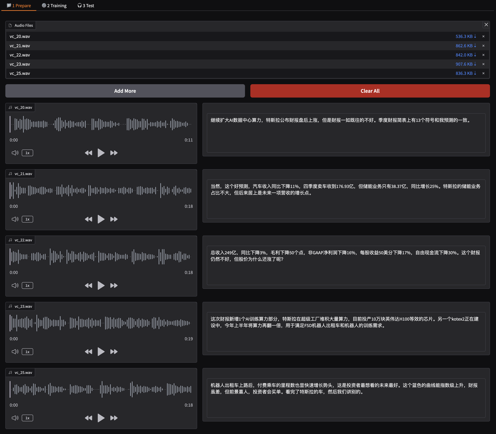
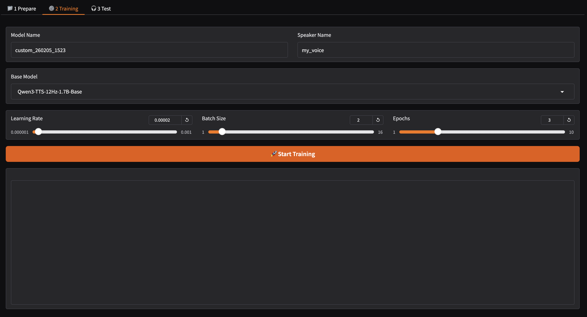
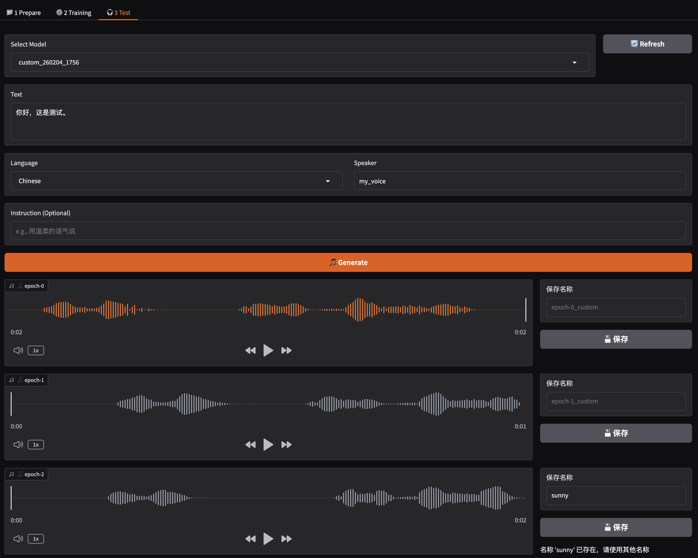
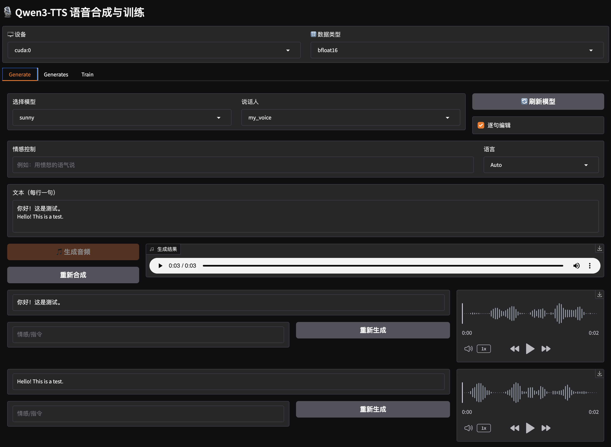
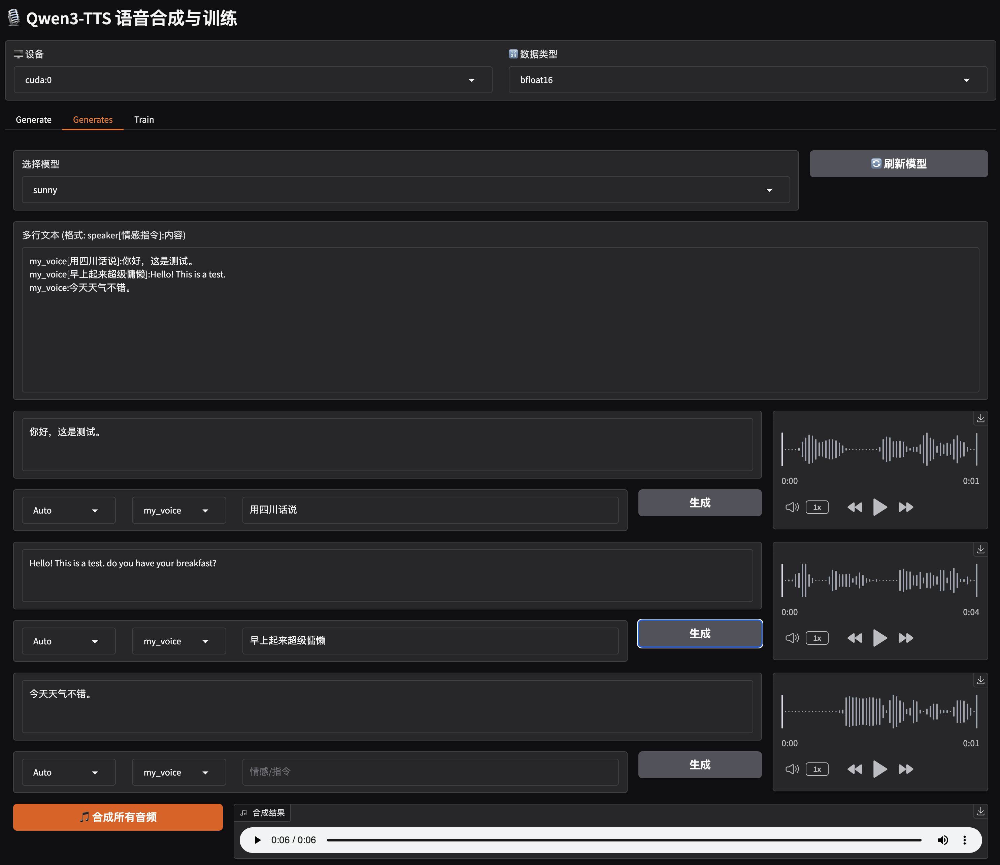

# Qwen3-TTS 语音合成与训练系统
中文版本 | [English](README.md)
## 概述

这是一个基于 Qwen3-TTS 模型的语音合成与训练系统，提供了完整的模型训练、测试和推理功能。支持自定义语音克隆、多说话人对话生成，以及可视化的训练管理界面。

## 主要功能

### 1. 语音生成 (Generate)
- **单文本生成**: 支持单段文本的语音合成
- **多行文本生成**: 支持逐句编辑和批量处理
- **情感控制**: 支持情感指令控制语音表达
- **实时预览**: 生成过程中可实时查看和播放音频

### 2. 多说话人对话生成 (Generates)
- **格式解析**: 支持 `说话人[情感指令]:内容` 格式的文本解析
- **动态编辑**: 可单独调整每句话的说话人、语言和情感指令
- **批量生成**: 一键生成所有对话音频
- **音频预览**: 每句话独立预览和下载

### 3. 模型训练 (Train)
- **数据准备**: 支持音频文件上传和自动语音识别
- **训练配置**: 可调整学习率、批次大小、训练轮数等参数
- **实时监控**: 训练过程实时显示日志和状态
- **检查点管理**: 支持多个训练检查点的测试和保存
## 界面截图

### 训练流程

*数据准备和训练配置界面*


*实时训练进度监控*


*模型测试和检查点评估*

### 语音生成

*单文本语音生成界面*


*多说话人对话生成界面*

## 安装和使用

### 环境要求
```bash
pip install qwen-tts
pip install funasr  # 用于语音识别
```

## 模型准备

模型会在首次使用时自动下载，也可以手动下载：

```bash
modelscope download --model Qwen/Qwen3-TTS-Tokenizer-12Hz  --local_dir ./Qwen3-TTS-Tokenizer-12Hz 
modelscope download --model Qwen/Qwen3-TTS-12Hz-1.7B-Base --local_dir ./Qwen3-TTS-12Hz-1.7B-Base
modelscope download --model Qwen/Qwen3-TTS-12Hz-0.6B-Base --local_dir ./Qwen3-TTS-12Hz-0.6B-Base
```
```
|-- Qwen3-TTS-12Hz-1.7B-Base
|-- Qwen3-TTS-12Hz-0.6B-Base
|-- Qwen3-TTS-Tokenizer-12Hz
├── multy_speaker.png
├── README_CN.md
├── README.md
├── single_speaker.png
├── train_prepare.png
├── train_test.png
├── training.png
├── generate.py
└── main.py
```
### 启动方式

#### 1. 基础使用（仅生成功能）
```bash
python main.py
```

#### 2. 完整功能（包含训练）
```bash
python main.py --train
```

#### 3. 自定义配置
```bash
python main.py --train --port 8080 --device cuda:0 --dtype bfloat16
```

### 参数说明
- `--train` / `-t`: 启用训练功能
- `--port` / `-p`: 服务端口 (默认: 8886)
- `--server` / `-s`: 服务地址 (默认: 0.0.0.0)
- `--device` / `-d`: 计算设备 (cuda:0, cpu 等)
- `--dtype`: 数据精度 (bfloat16, float16, float32)
